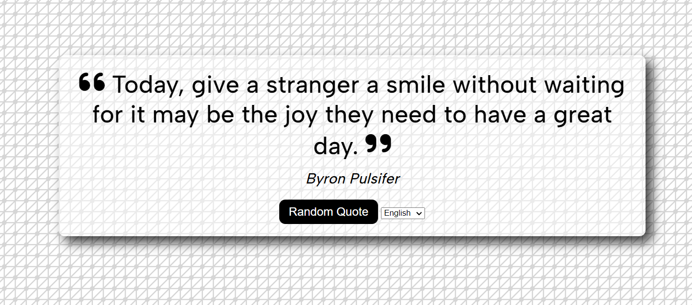

# GetQuote

A simple quote generator made using HTML5, CSS and JavaScript for practice. The quotes and authors are retrieved using the API here: https://forismatic.com/en/api/. 
The background is a repeatable SVG pattern retrieved from Hero Patterns: https://heropatterns.com/

The only languages available for the API are English and Russian, so a language button was added to change between the two languages.

